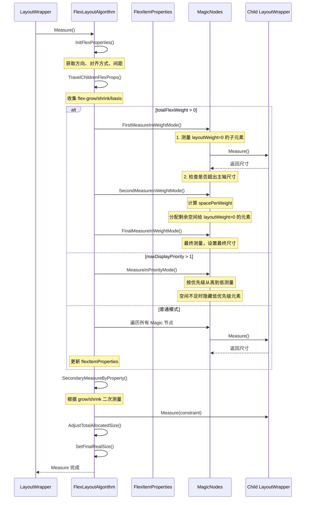
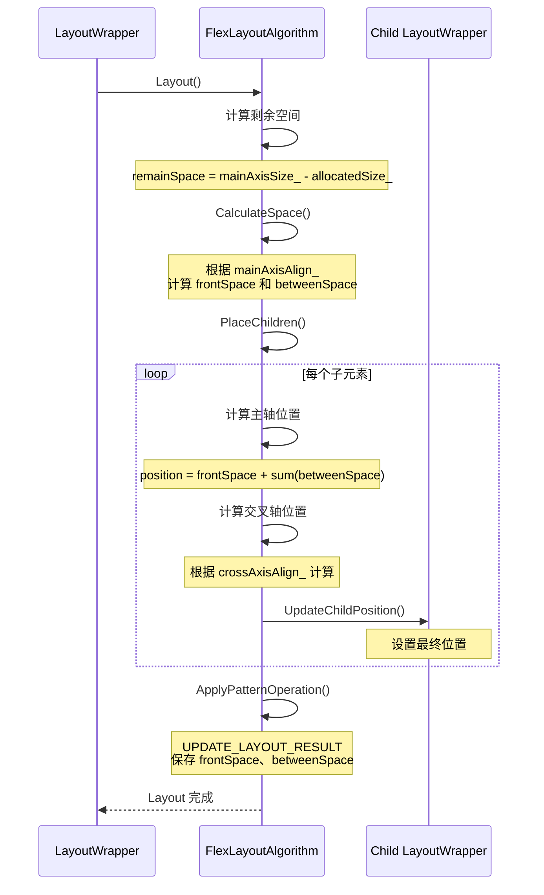
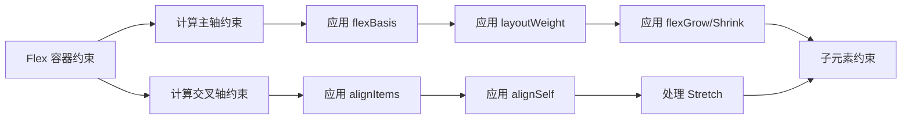
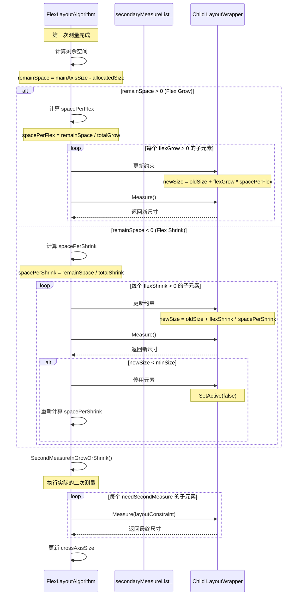

# ArkUI Flex 组件完整知识库

> **版本**: 1.0
> **更新时间**: 2026-02-05
> **基于**: OpenHarmony ace_engine (master 分支)

---

## 目录

1. [架构概述](#1-架构概述)
2. [核心类详解](#2-核心类详解)
3. [完整布局流程](#3-完整布局流程)
4. [关键技术点](#4-关键技术点)
5. [属性系统](#5-属性系统)
6. [FlexItem 属性](#6-flexitem-属性)
7. [Wrap 布局](#7-wrap-布局)
8. [最佳实践](#8-最佳实践)
9. [问题排查](#9-问题排查)

---

## 1. 架构概述

### 1.1 系统架构

Flex 组件是 OpenHarmony 中最核心的布局容器，实现了标准的 Flex 布局规范，采用 3 层架构：

```
ArkTS 前端 (Row/Column/Wrap)
    ↓
桥接层 (FlexModelNG) - 属性解析和节点创建
    ↓
模式层 (FlexLayoutPattern) - 业务逻辑和算法选择
    ↓
算法层 (FlexLayoutAlgorithm/WrapLayoutAlgorithm) - 布局算法实现
```

**设计原则**：
- **弹性布局**: 主轴和交叉轴灵活分配空间
- **方向控制**: 支持 Row/Column 及其反向变体
- **对齐丰富**: justifyContent、alignItems、alignContent 多维度对齐
- **换行支持**: Flex 支持单行布局，Wrap 支持多行换行
- **性能优化**: Measure-Layout 配对机制，避免重复计算

### 1.2 组件分类

**Flex 弹性容器**：
- Flex 组件可以通过 `flexDirection` 属性配置成 4 种方向：
  - `FlexDirection.Row` - 横向从左到右
  - `FlexDirection.RowReverse` - 横向从右到左
  - `FlexDirection.Column` - 纵向从上到下
  - `FlexDirection.ColumnReverse` - 纵向从下到上
- 此时组件作为 **Flex 组件**，被称为**弹性容器**
- 支持所有 Flex 属性（justifyContent、alignItems、space 等）

**Linear 线性容器**：
- Flex 有一个子类：**Linear**
- Linear 受 `isVertical_` 参数控制，分为两种行为：
  - `isVertical_ = false` → **Row**（横向线性容器）
  - `isVertical_ = true` → **Column**（纵向线性容器）
- 提供简化的 API：
  - `Row()` 等价于 `Linear({ isVertical: false })`
  - `Column()` 等价于 `Linear({ isVertical: true })`
  - `Row({ reverse: true })` 等价于 `Linear({ isVertical: false, isReverse: true })`
  - `Column({ reverse: true })` 等价于 `Linear({ isVertical: true, isReverse: true })`
- 此时组件作为 **Row 组件 / Column 组件**，被称为**线性容器**

**组件关系图**：
```
Flex (弹性容器)
├── 可配置方向 (Row/RowReverse/Column/ColumnReverse)
└── 完整 Flex 属性支持

Linear (线性容器) - Flex 的子类
├── 受 isVertical 参数控制
│   ├── isVertical=false → Row (横向)
│   └── isVertical=true → Column (纵向)
├── 提供 reverse 参数
└── 默认避免二次布局

Wrap (换行容器)
├── Horizontal / Vertical 方向
└── 支持多行布局
```

**设计理念**：
- **Flex**：提供完整的弹性布局能力，适用于需要复杂空间分配的场景
- **Linear (Row/Column)**：提供简化的线性布局 API，适用于常见的一维排列场景
- **Wrap**：提供自动换行能力，适用于标签云等场景

### 1.3 代码规模

- **Pattern 文件**: 1 个 (`flex_layout_pattern.h`)
- **Algorithm 文件**: 2 个 (`flex_layout_algorithm.h/cpp`, `wrap_layout_algorithm.h/cpp`)
- **Property 文件**: 2 个 (`flex_layout_property.h`, `flex_layout_styles.h`)
- **Model 文件**: 3 个 (`flex_model_ng.h/cpp`, `flex_model_ng_static.h/cpp`)
- **总代码量**: 约 3000+ 行 C++ 代码

---

## 2. 核心类详解

### 2.1 FlexLayoutPattern

**职责**：
- 管理 Flex 布局配置（方向、对齐方式、间距）
- 选择正确的布局算法（Flex vs Wrap）
- 处理 Measure-Layout 配对验证
- 提供焦点管理和无障碍支持
- 溢出处理（VerticalOverflowHandler）

**关键成员变量**：
```cpp
// 布局模式
bool isWrap_ = false;                      // 是否为 Wrap 布局
bool isDialogStretch_ = false;             // 对话框拉伸模式

// Measure-Layout 配对
FlexMeasureResult measureResult_;          // Measure 结果
FlexLayoutResult layoutResult_;            // Layout 结果
std::optional<uintptr_t> measuredAddress_; // Measure 地址
std::optional<uintptr_t> layoutedAddress_; // Layout 地址

// 溢出处理
RefPtr<VerticalOverflowHandler> vOverflowHandler_; // 垂直溢出处理器
```

**关键方法**：

- **CreateLayoutProperty()**: 创建布局属性
  ```cpp
  RefPtr<LayoutProperty> CreateLayoutProperty() override {
      return MakeRefPtr<FlexLayoutProperty>();
  }
  ```
  源码位置: `OpenHarmony/foundation/arkui/ace_engine/frameworks/core/components_ng/pattern/flex/flex_layout_pattern.h:38-41`

- **CreateLayoutAlgorithm()**: 创建布局算法
  ```cpp
  RefPtr<LayoutAlgorithm> CreateLayoutAlgorithm() override {
      if (isWrap_) {
          return MakeRefPtr<WrapLayoutAlgorithm>(isDialogStretch_);
      }
      return MakeRefPtr<FlexLayoutAlgorithm>();
  }
  ```
  源码位置: `OpenHarmony/foundation/arkui/ace_engine/frameworks/core/components_ng/pattern/flex/flex_layout_pattern.h:43-49`

- **GetMeasureLayoutPaired()**: 验证 Measure-Layout 配对
  ```cpp
  bool GetMeasureLayoutPaired() {
      return (measuredAddress_ && layoutedAddress_ &&
              (measuredAddress_.value() == layoutedAddress_.value()));
  }
  ```
  源码位置: `OpenHarmony/foundation/arkui/ace_engine/frameworks/core/components_ng/pattern/flex/flex_layout_pattern.h:207-210`

- **GetScopeFocusAlgorithm()**: 获取焦点范围算法
  ```cpp
  ScopeFocusAlgorithm GetScopeFocusAlgorithm() override {
      auto property = GetLayoutProperty<FlexLayoutProperty>();
      if (!property) {
          return {};
      }
      bool isVertical = false;
      if (property->GetFlexDirection().has_value()) {
          isVertical = property->GetFlexDirection().value() == FlexDirection::COLUMN ||
                       property->GetFlexDirection().value() == FlexDirection::COLUMN_REVERSE;
      }
      return { isVertical, true, isWrap_ ? ScopeType::PROJECT_AREA : ScopeType::FLEX };
  }
  ```
  源码位置: `OpenHarmony/foundation/arkui/ace_engine/frameworks/core/components_ng/pattern/flex/flex_layout_pattern.h:66-78`

### 2.2 FlexLayoutAlgorithm

**职责**：
- 实现 Flex 布局算法（Measure 和 Layout）
- 计算子元素的主轴和交叉轴尺寸
- 处理 flex-grow、flex-shrink、flex-basis
- 处理空白元素（Blank）的特殊布局
- 支持基线对齐（Baseline Alignment）

**关键成员变量**：
```cpp
// 尺寸相关
OptionalSizeF realSize_;              // 实际尺寸
float mainAxisSize_ = 0.0f;          // 主轴尺寸
float crossAxisSize_ = 0.0f;         // 交叉轴尺寸
float selfIdealCrossAxisSize_ = -1.0f; // 理想交叉轴尺寸
float allocatedSize_ = 0.0f;         // 已分配尺寸

// Flex 属性
float space_ = 0.0f;                 // 子元素间距
float totalFlexWeight_ = 0.0f;       // 总 flex 权重
int32_t maxDisplayPriority_ = 0;     // 最大显示优先级
int32_t validSizeCount_ = 0;         // 有效尺寸计数

// 对齐方式
FlexAlign crossAxisAlign_ = FlexAlign::FLEX_START;     // 交叉轴对齐
FlexAlign mainAxisAlign_ = FlexAlign::FLEX_START;     // 主轴对齐

// 布局方向
FlexDirection direction_ = FlexDirection::ROW;         // 布局方向

// Magic Nodes（显示优先级相关）
std::map<int32_t, std::list<MagicLayoutNode>> magicNodes_;
std::map<int32_t, float> magicNodeWeights_;
std::list<MagicLayoutNode> secondaryMeasureList_;

// 基线属性
BaselineProperties baselineProperties_;

// 特殊标志
bool isLinearLayoutFeature_ = false;  // LinearLayout 特性
bool isInfiniteLayout_ = false;       // 无限布局
bool selfAdaptive_ = false;           // 自适应
TextDirection textDir_ = TextDirection::LTR; // 文本方向
bool childrenHasAlignSelfBaseLine_ = false; // 子元素有基线对齐
```

**关键方法**：

- **Measure()**: 测量主容器和子元素尺寸
  ```cpp
  void FlexLayoutAlgorithm::Measure(LayoutWrapper* layoutWrapper) {
      // 1. 初始化 Flex 属性
      InitFlexProperties(layoutWrapper);
  
      // 2. 遍历子元素 Flex 属性
      TravelChildrenFlexProps(layoutWrapper);
  
      // 3. 测量和清理 Magic 节点
      MeasureAndCleanMagicNodes(layoutWrapper, flexItemProperties);
  
      // 4. 二次测量（根据 grow/shrink）
      SecondaryMeasureByProperty(flexItemProperties, layoutWrapper);
  
      // 5. 更新已分配尺寸
      AdjustTotalAllocatedSize(layoutWrapper);
  
      // 6. 设置最终尺寸
      SetFinalRealSize(layoutWrapper, realSize_, layoutPolicy);
  }
  ```
  源码位置: `OpenHarmony/foundation/arkui/ace_engine/frameworks/core/components_ng/pattern/flex/flex_layout_algorithm.cpp`

- **Layout()**: 布局子元素位置
  ```cpp
  void FlexLayoutAlgorithm::Layout(LayoutWrapper* layoutWrapper) {
      // 1. 计算空间分配
      CalculateSpace(remainSpace, frontSpace, betweenSpace);
  
      // 2. 放置子元素
      PlaceChildren(layoutWrapper, frontSpace, betweenSpace, paddingOffset);
  
      // 3. 应用 Pattern 操作
      ApplyPatternOperation(layoutWrapper, FlexOperatorType::UPDATE_LAYOUT_RESULT);
  }
  ```
  源码位置: `OpenHarmony/foundation/arkui/ace_engine/frameworks/core/components_ng/pattern/flex/flex_layout_algorithm.cpp`

- **CalculateSpace()**: 计算前导空间和元素间距
  ```cpp
  void FlexLayoutAlgorithm::CalculateSpace(
      float remainSpace, float& frontSpace, float& betweenSpace) const {
      switch (mainAxisAlign_) {
          case FlexAlign::FLEX_START:
              frontSpace = 0.0f;
              betweenSpace = space_.ConvertToPx();
              break;
          case FlexAlign::FLEX_END:
              frontSpace = remainSpace;
              betweenSpace = space_.ConvertToPx();
              break;
          case FlexAlign::CENTER:
              frontSpace = remainSpace / 2.0f;
              betweenSpace = space_.ConvertToPx();
              break;
          case FlexAlign::SPACE_BETWEEN:
              frontSpace = 0.0f;
              betweenSpace = validSizeCount_ > 1 ? remainSpace / (validSizeCount_ - 1) : 0.0f;
              break;
          case FlexAlign::SPACE_AROUND:
              betweenSpace = validSizeCount_ > 0 ? remainSpace / validSizeCount_ : 0.0f;
              frontSpace = betweenSpace / 2.0f;
              break;
          case FlexAlign::SPACE_EVENLY:
              betweenSpace = validSizeCount_ > 0 ? remainSpace / (validSizeCount_ + 1) : 0.0f;
              frontSpace = betweenSpace;
              break;
          default:
              break;
      }
  }
  ```
  源码位置: `OpenHarmony/foundation/arkui/ace_engine/frameworks/core/components_ng/pattern/flex/flex_layout_algorithm.cpp`

### 2.3 FlexLayoutProperty

**职责**：
- 存储 Flex 布局相关属性
- 提供 Flex 和 Wrap 两套属性系统
- 支持属性克隆和重置

**属性定义**：
```cpp
// Flex 布局属性
ACE_DEFINE_PROPERTY_ITEM_WITH_GROUP(FlexLayoutAttribute, FlexDirection, FlexDirection, PROPERTY_UPDATE_MEASURE);
ACE_DEFINE_PROPERTY_ITEM_WITH_GROUP(FlexLayoutAttribute, MainAxisAlign, FlexAlign, PROPERTY_UPDATE_MEASURE);
ACE_DEFINE_PROPERTY_ITEM_WITH_GROUP(FlexLayoutAttribute, CrossAxisAlign, FlexAlign, PROPERTY_UPDATE_MEASURE);
ACE_DEFINE_PROPERTY_ITEM_WITH_GROUP(FlexLayoutAttribute, Space, Dimension, PROPERTY_UPDATE_MEASURE);
ACE_DEFINE_PROPERTY_ITEM_WITH_GROUP(FlexLayoutAttribute, IsReverse, bool, PROPERTY_UPDATE_MEASURE);

// Wrap 布局属性
ACE_DEFINE_PROPERTY_ITEM_WITH_GROUP(WrapLayoutAttribute, WrapDirection, WrapDirection, PROPERTY_UPDATE_MEASURE);
ACE_DEFINE_PROPERTY_ITEM_WITH_GROUP(WrapLayoutAttribute, Alignment, WrapAlignment, PROPERTY_UPDATE_MEASURE);
ACE_DEFINE_PROPERTY_ITEM_WITH_GROUP(WrapLayoutAttribute, MainAlignment, WrapAlignment, PROPERTY_UPDATE_MEASURE);
ACE_DEFINE_PROPERTY_ITEM_WITH_GROUP(WrapLayoutAttribute, CrossAlignment, WrapAlignment, PROPERTY_UPDATE_MEASURE);
ACE_DEFINE_PROPERTY_ITEM_WITH_GROUP(WrapLayoutAttribute, CrossSpace, Dimension, PROPERTY_UPDATE_MEASURE);
```

源码位置: `OpenHarmony/foundation/arkui/ace_engine/frameworks/core/components_ng/pattern/flex/flex_layout_property.h:64-75`

### 2.4 FlexModelNG

**职责**：
- 提供 ArkTS 到 C++ 的桥接接口
- 创建 Flex 布局节点（Row/Column/Wrap）
- 设置 Flex 布局属性
- 支持静态 API 调用

**关键方法**：
```cpp
// 创建布局
void CreateFlexRow() override;
void CreateWrap() override;

// 设置方向
void SetDirection(FlexDirection direction) override;
void SetWrapDirection(WrapDirection direction) override;

// 设置对齐
void SetMainAxisAlign(FlexAlign align) override;
void SetCrossAxisAlign(FlexAlign align) override;
void SetWrapMainAlignment(WrapAlignment value) override;
void SetWrapCrossAlignment(WrapAlignment value) override;
void SetWrapAlignment(WrapAlignment value) override;

// 设置间距
void SetMainSpace(const std::optional<Dimension>& space) override;
void SetCrossSpace(const std::optional<Dimension>& space) override;
```

源码位置: `OpenHarmony/foundation/arkui/ace_engine/frameworks/core/components_ng/pattern/flex/flex_model_ng.h:24-70`

### 2.5 核心数据结构

**FlexMeasureResult** - Measure 结果：
```cpp
struct FlexMeasureResult {
    float allocatedSize = 0.0f;    // 已分配的主轴尺寸
    int32_t validSizeCount = 0;     // 有效尺寸计数
};
```

**FlexLayoutResult** - Layout 结果：
```cpp
struct FlexLayoutResult {
    float frontSpace = 0.0f;        // 前导空间
    float betweenSpace = 0.0f;      // 元素间距
};
```

**FlexItemProperties** - FlexItem 属性聚合：
```cpp
struct FlexItemProperties {
    float totalShrink = 0.0f;       // 总 shrink 值
    float totalGrow = 0.0f;         // 总 grow 值
    RefPtr<LayoutWrapper> lastShrinkChild; // 最后一个 shrink 子元素
    RefPtr<LayoutWrapper> lastGrowChild;   // 最后一个 grow 子元素
};
```

**MagicLayoutNode** - Magic 节点（显示优先级）：
```cpp
struct MagicLayoutNode {
    LayoutConstraintF layoutConstraint;
    RefPtr<LayoutWrapper> layoutWrapper;
    OptionalSizeF calcSize;
    bool needSecondMeasure = false;       // 是否需要二次测量
    bool needKeepMinCalcSize = false;     // 是否保持最小计算尺寸
};
```

---

## 3. 完整布局流程

### 3.1 Measure 流程



### 3.2 详细 Measure 步骤

```
LayoutWrapper::Measure()
    ↓
FlexLayoutAlgorithm::Measure()
    ↓
1. InitFlexProperties() - 初始化 Flex 属性
   - 获取方向 (direction_)
   - 获取对齐方式 (mainAxisAlign_, crossAxisAlign_)
   - 获取间距 (space_)
   - 获取主轴和交叉轴尺寸约束
    ↓
2. TravelChildrenFlexProps() - 遍历子元素 Flex 属性
   - 收集 flex-grow、flex-shrink
   - 收集 flex-basis
   - 收集 layoutWeight
   - 收集 displayPriority
   - 计算总权重 (totalFlexWeight_)
    ↓
3. MeasureAndCleanMagicNodes() - 测量 Magic 节点
   ↓
   [分支判断]
   ↓
   ├─> totalFlexWeight > 0 (layoutWeight 模式)
   │     ↓
   │     3.1 FirstMeasureInWeightMode() - 首次测量
   │         - 测量 layoutWeight=0 的子元素
   │         - 累加已分配尺寸 (allocatedSize_)
   │         - 检查是否超出主轴约束
   │         - 如超出，停用低优先级元素
   │     ↓
   │     3.2 SecondMeasureInWeightMode() - 二次测量
   │         - 计算剩余空间: remainedMainAxisSize = mainAxisSize_ - allocatedSize_
   │         - 计算单位权重空间: spacePerWeight = remainedMainAxisSize / totalFlexWeight_
   │         - 为每个 layoutWeight>0 的子元素设置约束
   │         - childCalcSize = spacePerWeight * childLayoutWeight
   │         - 检查是否满足最小尺寸约束
   │         - 如不满足，停用低优先级元素，重新计算
   │     ↓
   │     3.3 FinalMeasureInWeightMode() - 最终测量
   │         - 应用最终约束
   │         - 执行 Measure
   │         - 更新 crossAxisSize_
   │
   ├─> maxDisplayPriority > 1 (显示优先级模式)
   │     ↓
   │     3.4 MeasureInPriorityMode()
   │         - 按优先级从高到低遍历
   │         - 测量每个优先级的子元素
   │         - 检查是否超出主轴尺寸
   │         - 超出时停用当前及更低优先级的所有元素
   │
   └─> 普通模式
         ↓
         3.5 遍历所有子元素
             - 应用 flexBasis 约束
             - 执行 Measure
             - 更新 flexItemProperties
             - 添加到 secondaryMeasureList_
    ↓
4. SecondaryMeasureByProperty() - 根据 grow/shrink 二次测量
   - CheckIsGrowOrShrink() - 检查是否需要 grow/shrink
   - 计算剩余空间
   - 分配剩余空间（remainSpace > 0 时 grow）
   - 压缩子元素（remainSpace < 0 时 shrink）
   - 更新 LayoutConstraint
   - SecondMeasureInGrowOrShrink() - 执行二次测量
    ↓
5. AdjustTotalAllocatedSize() - 调整已分配尺寸
   - 累加所有子元素主轴尺寸
   - 计算剩余空间
    ↓
6. SetFinalRealSize() - 设置最终尺寸
   - 根据约束设置容器尺寸
   - 更新 GeometryNode
```

### 3.3 Layout 流程



### 3.4 Layout 流程详解

```
LayoutWrapper::Layout()
    ↓
FlexLayoutAlgorithm::Layout()
    ↓
1. 计算剩余空间
   remainSpace = mainAxisSize_ - allocatedSize_
    ↓
2. CalculateSpace() - 计算空间分配
   - 根据 mainAxisAlign_ 计算 frontSpace
   - 计算子元素间距 betweenSpace
   - Start: frontSpace=0, betweenSpace=space
   - End: frontSpace=remainSpace, betweenSpace=space
   - Center: frontSpace=remainSpace/2, betweenSpace=space
   - SpaceBetween: frontSpace=0, betweenSpace=remainSpace/(n-1)
   - SpaceAround: frontSpace=betweenSpace/2, betweenSpace=remainSpace/n
   - SpaceEvenly: frontSpace=betweenSpace=remainSpace/(n+1)
    ↓
3. PlaceChildren() - 放置子元素
   for each child:
     a. 计算主轴位置
        - position = frontSpace + accumulatedSpace
        - accumulatedSpace += childMainAxisSize + betweenSpace
     b. 计算交叉轴位置
        - 根据 crossAxisAlign_ 计算
        - 处理 alignSelf 优先级
        - 处理基线对齐
        - 处理拉伸（Stretch）
     c. 更新子元素位置
        - UpdateChildPositionWidthIgnoreLayoutSafeArea()
    ↓
4. 应用 Pattern 操作
   ApplyPatternOperation(UPDATE_LAYOUT_RESULT)
   - 保存 frontSpace、betweenSpace
   - 验证 Measure-Layout 配对
```

### 3.5 Row vs Column 布局

**Row (横向布局)**：
```cpp
// 主轴: X 轴
// 交叉轴: Y 轴
FlexDirection::ROW:
  - 从左到右排列（RTL 时从右到左）
FlexDirection::ROW_REVERSE:
  - 从右到左排列
```

**Column (纵向布局)**：
```cpp
// 主轴: Y 轴
// 交叉轴: X 轴
FlexDirection::COLUMN:
  - 从上到下排列
FlexDirection::COLUMN_REVERSE:
  - 从下到上排列
```

---

## 4. 关键技术点

### 4.1 Flex Grow/Shrink 机制

**机制说明**：
- **Flex Grow**：当容器有剩余空间时，按比例分配给设置了 `flexGrow > 0` 的子元素
- **Flex Shrink**：当容器空间不足时，按比例压缩设置了 `flexShrink > 0` 的子元素
- 这两个机制都会触发**二次布局**，因此在不需要时应避免使用

**Flex 与 Linear (Row/Column) 的默认值差异**：

| 属性 | Flex 弹性容器 | Linear (Row/Column) 线性容器 |
|------|-----------------|----------------------------|
| **子元素默认 flexShrink** | 1 | 0 |
| **默认行为** | 参与收缩，可能触发二次布局 | 不参与收缩，避免二次布局 |
| **典型用途** | 需要动态空间分配 | 简单线性排列 |

```cpp
void FlexLayoutAlgorithm::CheckIsGrowOrShrink(
    std::function<float(const RefPtr<LayoutWrapper>&)>& getFlex,
    float remainSpace,
    float& spacePerFlex,
    FlexItemProperties& flexItemProperties,
    RefPtr<LayoutWrapper>& lastChild)
{
    if (remainSpace > 0 && flexItemProperties.totalGrow > 0) {
        // Flex Grow: 分配剩余空间
        spacePerFlex = remainSpace / flexItemProperties.totalGrow;
        for (auto child : children) {
            float grow = getFlex(child);
            if (grow > 0) {
                float extraSpace = grow * spacePerFlex;
                // 增加子元素主轴尺寸
                UpdateLayoutConstraintOnMainAxis(constraint, currentSize + extraSpace);
                child->Measure();
            }
        }
    } else if (remainSpace < 0 && flexItemProperties.totalShrink > 0) {
        // Flex Shrink: 按比例压缩
        spacePerFlex = remainSpace / flexItemProperties.totalShrink;
        for (auto child : children) {
            float shrink = getFlex(child);
            if (shrink > 0) {
                float reducedSpace = shrink * spacePerFlex;
                // 减小子元素主轴尺寸
                UpdateLayoutConstraintOnMainAxis(constraint, currentSize + reducedSpace);
                child->Measure();
            }
        }
    }
}
```

源码位置: `OpenHarmony/foundation/arkui/ace_engine/frameworks/core/components_ng/pattern/flex/flex_layout_algorithm.cpp:859-899`

**性能影响**：
- Flex 的 `flexShrink: 1` 默认值意味着所有子元素都可能参与收缩
- Linear (Row/Column) 的 `flexShrink: 0` 默认值避免了不必要的收缩计算
- 在嵌套布局中，这个差异会导致性能的指数级差异（详见 8.6 节）

### 4.2 Baseline 对齐

```cpp
void FlexLayoutAlgorithm::CheckBaselineProperties(const RefPtr<LayoutWrapper>& layoutWrapper) {
    if (crossAxisAlign_ != FlexAlign::BASELINE && !childrenHasAlignSelfBaseLine_) {
        return;
    }
    float distance = layoutWrapper->GetBaselineDistance();
    baselineProperties_.maxBaselineDistance = std::max(
        baselineProperties_.maxBaselineDistance, distance);
    baselineProperties_.maxDistanceAboveBaseline = std::max(
        baselineProperties_.maxDistanceAboveBaseline, distance);
    // 记录最大基线距离，用于 Layout 时对齐
}
```

源码位置: `OpenHarmony/foundation/arkui/ace_engine/frameworks/core/components_ng/pattern/flex/flex_layout_algorithm.cpp:193-200`

**Layout 时的基线对齐**：
```cpp
void FlexLayoutAlgorithm::SetCrossPos(
    const RefPtr<LayoutWrapper>& layoutWrapper,
    float& crossPos,
    const float& crossAxisSize) {
    if (crossAxisAlign_ == FlexAlign::BASELINE || GetSelfAlign(layoutWrapper) == FlexAlign::BASELINE) {
        // 根据基线位置计算交叉轴位置
        crossPos = baselineProperties_.maxBaselineDistance -
                   layoutWrapper->GetBaselineDistance();
    }
}
```

### 4.3 Blank 空白元素处理

```cpp
bool FlexLayoutAlgorithm::HandleBlankFirstTimeMeasure(
    const MagicLayoutNode& child,
    FlexItemProperties& flexItemProperties) {
    auto blankLayoutProperty = child.layoutWrapper->GetLayoutProperty();
    if (blankLayoutProperty && CheckBlankIllegality(blankLayoutProperty)) {
        // Blank 只在主轴上有 flex-grow 时才生效
        auto blankFlex = blankLayoutProperty->GetFlexItemProperty()->GetGrow();
        if (blankFlex > 0) {
            flexItemProperties.totalGrow += blankFlex;
            flexItemProperties.lastGrowChild = child.layoutWrapper;
            return true;
        }
    }
    return false;
}
```

源码位置: `OpenHarmony/foundation/arkui/ace_engine/frameworks/core/components_ng/pattern/flex/flex_layout_algorithm.cpp`

**Blank 的特殊规则**：
- Blank 元素的理想尺寸为 0
- 只有当 flex-grow > 0 时，Blank 才会占据剩余空间
- Blank 不参与 flex-shrink

### 4.4 显示优先级（Display Priority）

```cpp
void FlexLayoutAlgorithm::MeasureInPriorityMode(FlexItemProperties& flexItemProperties) {
    // 按优先级从高到低测量
    for (auto iter = magicNodes_.rbegin(); iter != magicNodes_.rend(); ++iter) {
        auto& [priority, childList] = *iter;
        for (auto& magicNode : childList) {
            magicNode.layoutWrapper->Measure(magicNode.layoutConstraint);
            // 累加已分配尺寸
            allocatedSize_ += GetChildMainAxisSize(magicNode.layoutWrapper);

            // 检查是否超出约束
            if (allocatedSize_ > mainAxisSize_) {
                // 超出，停止测量低优先级元素
                break;
            }
        }
    }
}
```

源码位置: `OpenHarmony/foundation/arkui/ace_engine/frameworks/core/components_ng/pattern/flex/flex_layout_algorithm.cpp`

**显示优先级机制**：
- 子元素可以设置 `displayPriority` 属性
- 空间不足时，优先显示高优先级元素
- 低优先级元素会被隐藏（Visibility::GONE）

### 4.5 Measure-Layout 配对验证

```cpp
bool FlexLayoutPattern::GetMeasureLayoutPaired() {
    return (measuredAddress_ && layoutedAddress_ &&
            (measuredAddress_.value() == layoutedAddress_.value()));
}
```

源码位置: `OpenHarmony/foundation/arkui/ace_engine/frameworks/core/components_ng/pattern/flex/flex_layout_pattern.h:207-210`

**配对验证机制**：
- Measure 时保存 LayoutWrapper 指针地址到 `measuredAddress_`
- Layout 时保存 LayoutWrapper 指针地址到 `layoutedAddress_`
- 通过比较地址判断是否为同一轮布局
- 用于检测布局过程中的状态不一致

### 4.6 layoutWeight 权重布局

**layoutWeight** 是 OpenHarmony 提供的权重分配机制，允许子元素按照权重比例分配剩余空间。

**API 定义**：
```typescript
.layoutWeight(weight: number) // 权重值，必须大于 0
```

**实现原理**：
```cpp
void FlexLayoutAlgorithm::FirstMeasureInWeightMode() {
    // 1. 首先测量所有 layoutWeight=0 的子元素
    for (auto& [priority, childList] : magicNodes_) {
        for (auto& child : childList) {
            auto childLayoutWrapper = child.layoutWrapper;
            float childLayoutWeight = childLayoutWrapper->GetLayoutProperty()
                ->GetMagicItemProperty().GetLayoutWeight().value_or(0.0f);

            if (childLayoutWeight == 0.0f) {
                // 正常测量
                childLayoutWrapper->Measure(child.layoutConstraint);
                UpdateAllocatedSize(childLayoutWrapper, crossAxisSize_);
            }
            // layoutWeight>0 的元素跳过，稍后处理
        }
    }

    // 2. 检查是否超出主轴尺寸
    if (allocatedSize_ > mainAxisSize_) {
        // 超出，停用低优先级元素
        for (const auto& child : childList) {
            allocatedSize_ -= GetChildMainAxisSize(child.layoutWrapper);
            child.layoutWrapper->SetActive(false);
        }
    }
}
```

源码位置: `OpenHarmony/foundation/arkui/ace_engine/frameworks/core/components_ng/pattern/flex/flex_layout_algorithm.cpp:380-440`

**二次分配权重空间**：
```cpp
void FlexLayoutAlgorithm::SecondMeasureInWeightMode(
    std::map<int32_t, std::list<MagicLayoutNode>>::reverse_iterator firstLoopIter)
{
    auto newTotalFlexWeight = totalFlexWeight_;
    allocatedSize_ -= space_;
    auto remainedMainAxisSize = mainAxisSize_ - allocatedSize_;
    auto spacePerWeight = remainedMainAxisSize / newTotalFlexWeight;

    // 按优先级从高到低分配
    auto secondIterLoop = magicNodes_.rbegin();
    while (secondIterLoop != firstLoopIter) {
        auto& childList = secondIterLoop->second;
        bool isExceed = false;

        for (auto& child : childList) {
            auto childLayoutWrapper = child.layoutWrapper;
            float childLayoutWeight = childLayoutWrapper->GetLayoutProperty()
                ->GetMagicItemProperty().GetLayoutWeight().value_or(0.0f);

            if (childLayoutWeight <= 0.0f) {
                continue;
            }

            // 计算该元素应得的尺寸
            float childCalcSize = spacePerWeight * childLayoutWeight;

            // 检查是否满足最小尺寸约束
            if (GetMainAxisSizeHelper(child.layoutConstraint.minSize, direction_) > childCalcSize) {
                isExceed = true;
                break;
            }

            // 设置主轴约束
            UpdateLayoutConstraintOnMainAxis(child.layoutConstraint, childCalcSize);
        }

        if (isExceed) {
            // 不满足最小约束，停用低优先级元素，重新计算
            auto& lowPriorityChildList = magicNodes_.begin()->second;
            for (const auto& child : lowPriorityChildList) {
                allocatedSize_ -= GetChildMainAxisSize(child.layoutWrapper);
                child.layoutWrapper->SetActive(false);
            }
            newTotalFlexWeight -= magicNodeWeights_[magicNodes_.begin()->first];
            remainedMainAxisSize = mainAxisSize_ - allocatedSize_;
            spacePerWeight = remainedMainAxisSize / newTotalFlexWeight;
            magicNodes_.erase(magicNodes_.begin());
            secondIterLoop = magicNodes_.rbegin();
        } else {
            secondIterLoop++;
        }
    }
}
```

源码位置: `OpenHarmony/foundation/arkui/ace_engine/frameworks/core/components_ng/pattern/flex/flex_layout_algorithm.cpp:442-492`

**layoutWeight 使用示例**：
```typescript
Row() {
  Text('Child1')
    .layoutWeight(1)  // 占据 1/3 空间
    .backgroundColor(Color.Red)
  Text('Child2')
    .layoutWeight(2)  // 占据 2/3 空间
    .backgroundColor(Color.Blue)
}
  .width('100%')
```

**注意事项**：
- layoutWeight 必须大于 0
- layoutWeight 优先级高于 width/height
- 如果所有子元素都设置了 layoutWeight，它们按权重比例分配空间
- 如果部分子元素设置了 layoutWeight，它们分配剩余空间

### 4.7 constraintSize 约束尺寸

**constraintSize** 是 LayoutConstraintF 的一部分，用于约束子元素的最大/最小尺寸。

**LayoutConstraintF 结构**：
```cpp
struct LayoutConstraintF {
    OptionalSizeF minSize;           // 最小尺寸
    OptionalSizeF maxSize;           // 最大尺寸
    OptionalSizeF selfIdealSize;     // 理想尺寸
    PercentageConstraint percentReference;  // 百分比参考
    // ... 其他约束
};
```

**约束更新机制**：
```cpp
void FlexLayoutAlgorithm::UpdateLayoutConstraintOnMainAxis(
    LayoutConstraintF& layoutConstraint, float size)
{
    if (IsHorizontal(direction_)) {
        // 横向布局：更新宽度约束
        if (size < 0.0f) {
            layoutConstraint.maxSize.SetWidth(std::numeric_limits<float>::max());
        } else {
            layoutConstraint.maxSize.SetWidth(size);
            layoutConstraint.percentWarning.SetWidth(size);
        }
    } else {
        // 纵向布局：更新高度约束
        if (size < 0.0f) {
            layoutConstraint.maxSize.SetHeight(std::numeric_limits<float>::max());
        } else {
            layoutConstraint.maxSize.SetHeight(size);
            layoutConstraint.percentWarning.SetHeight(size);
        }
    }
}
```

**交叉轴约束更新**：
```cpp
void FlexLayoutAlgorithm::UpdateLayoutConstraintOnCrossAxis(
    LayoutConstraintF& layoutConstraint, float size)
{
    if (IsHorizontal(direction_)) {
        // 横向布局：更新高度约束
        layoutConstraint.maxSize.SetHeight(size);
    } else {
        // 纵向布局：更新宽度约束
        layoutConstraint.maxSize.SetWidth(size);
    }
}
```

**约束传递流程**：


### 4.8 二次布局机制详解

Flex 布局采用二次测量（Two-Pass Measure）机制，确保空间分配的准确性。

**为什么需要二次测量**？

1. **第一次测量**：计算子元素的自然尺寸
   - 应用 flexBasis
   - 应用固定尺寸（width/height）
   - 收集 flex-grow 和 flex-shrink 值

2. **第二次测量**：根据剩余空间调整
   - 计算剩余空间（remainSpace）
   - 应用 flexGrow 分配剩余空间
   - 应用 flexShrink 压缩子元素
   - 处理 layoutWeight 权重分配

**二次测量序列图**：


**二次测量关键代码**：
```cpp
void FlexLayoutAlgorithm::SecondaryMeasureByProperty(
    FlexItemProperties& flexItemProperties, LayoutWrapper* layoutWrapper)
{
    float remainSpace = mainAxisSize_ - allocatedSize_;
    float spacePerFlex = 0;
    std::function<float(const RefPtr<LayoutWrapper>&)> getFlex;
    RefPtr<LayoutWrapper> lastChild;

    // 循环直到不再需要二次测量
    bool needSecondMeasure = true;
    while (needSecondMeasure) {
        needSecondMeasure = false;

        // 1. 确定使用 grow 还是 shrink
        CheckIsGrowOrShrink(getFlex, remainSpace, spacePerFlex, flexItemProperties, lastChild);

        // 2. 遍历需要二次测量的子元素
        for (auto& child : secondaryMeasureList_) {
            auto childLayoutWrapper = child.layoutWrapper;
            if (!childLayoutWrapper->IsActive()) {
                continue;
            }

            // 3. 处理 Stretch 对齐
            if (GetSelfAlign(childLayoutWrapper) == FlexAlign::STRETCH) {
                UpdateLayoutConstraintOnCrossAxis(child.layoutConstraint, crossAxisSize);
                child.needSecondMeasure = true;
            }

            // 4. 应用 flexGrow 或 flexShrink
            if (LessOrEqual(totalFlexWeight_, 0.0f)) {
                float itemFlex = getFlex(child.layoutWrapper);
                float flexSize = spacePerFlex * itemFlex;

                if (flexSize > 0) {
                    flexSize += GetChildMainAxisSize(childLayoutWrapper);
                    child.needSecondMeasure = true;

                    // 5. 检查是否满足最小尺寸约束
                    if (IsKeepMinSize(childLayoutWrapper, flexSize)) {
                        needSecondMeasure = true;
                        // 移除不满足约束的元素，重新计算
                        flexItemProperties.totalShrink -= itemFlex * childMainAxisSize;
                        continue;
                    }

                    UpdateLayoutConstraintOnMainAxis(child.layoutConstraint, flexSize);
                }
            }
        }

        // 6. 如果有元素被停用，重新计算
        if (needSecondMeasure) {
            allocatedSize_ -= reserveMainAxisSize;
            remainSpace = mainAxisSize_ - allocatedSize_;
        }
    }

    // 7. 执行最终的二次测量
    SecondMeasureInGrowOrShrink();
}
```

源码位置: `OpenHarmony/foundation/arkui/ace_engine/frameworks/core/components_ng/pattern/flex/flex_layout_algorithm.cpp:753-857`

**二次测量触发条件**：

| 条件 | 触发二次测量 | 说明 |
|------|-------------|------|
| **flexGrow > 0** | ✓ | 剩余空间 > 0 时 |
| **flexShrink > 0** | ✓ | 剩余空间 < 0 时 |
| **layoutWeight > 0** | ✓ | 权重分配模式 |
| **alignItems = Stretch** | ✓ | 交叉轴拉伸 |
| **alignSelf = Stretch** | ✓ | 子元素独立拉伸 |
| **Blank 元素** | ✓ | 空白元素处理 |

**二次测量优化**：

1. **避免无限循环**：
   ```cpp
   if (IsKeepMinSize(childLayoutWrapper, flexSize)) {
       needSecondMeasure = true;
       child.needKeepMinCalcSize = true;  // 标记，避免重复处理
       flexItemProperties.totalShrink -= shrinkSize;
       continue;  // 重新计算
   }
   ```

2. **处理最小尺寸约束**：
   ```cpp
   bool FlexLayoutAlgorithm::IsKeepMinSize(
       const RefPtr<LayoutWrapper>& childLayoutWrapper, float& flexSize) {
       auto childConstraint = childLayoutWrapper->GetLayoutProperty()->GetLayoutConstraint();
       if (childConstraint) {
           float minSize = GetMainAxisSizeHelper(childConstraint->minSize, direction_);
           return flexSize < minSize;
       }
       return false;
   }
   ```

3. **停用不满足约束的元素**：
   ```cpp
   if (flexSize <= 0.0f) {
       child.layoutWrapper->SetActive(false);
       flexItemProperties.totalShrink -= itemFlex * childMainAxisSize;
       reserveMainAxisSize += GetChildMainAxisSize(childLayoutWrapper);
       needSecondMeasure = true;
       UpdateLayoutConstraintOnMainAxis(child.layoutConstraint, 0.0f);
       break;
   }
   ```

---

## 5. 属性系统

### 5.1 Flex 布局属性 (Row/Column)

| 属性 | 类型 | 默认值 | 说明 |
|------|------|--------|------|
| **flexDirection** | FlexDirection | Row.Row | 主轴方向（Row/Column/RowReverse/ColumnReverse） |
| **justifyContent** | FlexAlign | FlexAlign.Start | 主轴对齐方式 |
| **alignItems** | FlexAlign | FlexAlign.Start | 交叉轴对齐方式 |
| **alignContent** | FlexAlign | FlexAlign.Start | 多行交叉轴对齐（仅 Wrap） |
| **space** | Dimension | 0 | 子元素间距 |

### 5.2 FlexDirection 枚举

```cpp
enum class FlexDirection {
    ROW = 0,            // 横向，主轴从左到右
    COLUMN,             // 纵向，主轴从上到下
    ROW_REVERSE,        // 横向反向，主轴从右到左
    COLUMN_REVERSE,     // 纵向反向，主轴从下到上
};
```

**主轴和交叉轴方向**：

| FlexDirection | 主轴方向 | 交叉轴方向 | 主轴起点 | 主轴终点 |
|--------------|---------|-----------|---------|---------|
| **Row** | 水平（X轴） | 垂直（Y轴） | 左侧 | 右侧 |
| **RowReverse** | 水平（X轴） | 垂直（Y轴） | 右侧 | 左侧 |
| **Column** | 垂直（Y轴） | 水平（X轴） | 顶部 | 底部 |
| **ColumnReverse** | 垂直（Y轴） | 水平（X轴） | 底部 | 顶部 |

**通用属性 direction 的影响**：

`direction` 属性控制文本方向和布局方向，会影响 Row 和 RowReverse 的行为：

```typescript
// direction: Direction.LTR (从左到右，默认)
Flex({ direction: FlexDirection.Row })        // 主轴: 左 → 右
Flex({ direction: FlexDirection.RowReverse }) // 主轴: 右 → 左

// direction: Direction.RTL (从右到左)
Flex({ direction: FlexDirection.Row })        // 主轴: 右 → 左 (反转)
Flex({ direction: FlexDirection.RowReverse }) // 主轴: 左 → 右 (反转)

// direction 属性对 Column/ColumnReverse 无影响
Flex({ direction: FlexDirection.Column })        // 主轴: 上 → 下
Flex({ direction: FlexDirection.ColumnReverse }) // 主轴: 下 → 上
```

**RTL 环境下的实际方向**：

```cpp
// 判断是否从左上角开始（IsStartTopLeft）
bool IsStartTopLeft(FlexDirection direction, TextDirection textDirection) {
    switch (direction) {
        case FlexDirection::ROW:
            return textDirection == TextDirection::LTR;  // LTR: 左→右, RTL: 右→左
        case FlexDirection::ROW_REVERSE:
            return textDirection == TextDirection::RTL;  // LTR: 右→左, RTL: 左→右
        case FlexDirection::COLUMN:
            return true;                                 // 总是上→下
        case FlexDirection::COLUMN_REVERSE:
            return false;                                // 总是下→上
    }
}
```

源码位置: `OpenHarmony/foundation/arkui/ace_engine/frameworks/core/components_ng/pattern/flex/flex_layout_algorithm.cpp:42-56`

**Row/Column 的 reverse 属性**：

Row 和 Column 组件提供了简化的 `reverse` 属性：

```typescript
// Row 组件
Row()                    // 等价于 Flex({ direction: FlexDirection.Row })
Row({ reverse: true })    // 等价于 Flex({ direction: FlexDirection.RowReverse })

// Column 组件
Column()                  // 等价于 Flex({ direction: FlexDirection.Column })
Column({ reverse: true })  // 等价于 Flex({ direction: FlexDirection.ColumnReverse })
```

**方向组合示例**：

```typescript
// LTR 环境，direction: Direction.LTR
Row()                        // 左 → 右
Row({ reverse: true })      // 右 → 左
Flex({ direction: FlexDirection.Row })           // 左 → 右
Flex({ direction: FlexDirection.RowReverse })    // 右 → 左

// RTL 环境，direction: Direction.RTL
Row()                        // 右 → 左 (受 direction 影响)
Row({ reverse: true })      // 左 → 右 (受 direction 影响)
Flex({ direction: FlexDirection.Row })           // 右 → 左 (受 direction 影响)
Flex({ direction: FlexDirection.RowReverse })    // 左 → 右 (受 direction 影响)

// Column 不受 direction 影响
Column()                     // 上 → 下
Column({ reverse: true })   // 下 → 上
```

### 5.3 FlexAlign 枚举

```cpp
enum class FlexAlign {
    FLEX_START = 0,     // 起点
    FLEX_END,           // 终点
    CENTER,             // 居中
    SPACE_BETWEEN,      // 两端对齐，中间均匀分布
    SPACE_AROUND,       // 环绕分布
    SPACE_EVENLY,       // 均匀分布
    BASELINE,           // 基线对齐（仅交叉轴）
};
```

**justifyContent 对齐效果**：
- **Start**: 所有子元素靠起点对齐
- **End**: 所有子元素靠终点对齐
- **Center**: 所有子元素居中对齐
- **SpaceBetween**: 两端对齐，子元素之间均匀分配空间
- **SpaceAround**: 每个子元素两侧空间相等
- **SpaceEvenly**: 所有空间（包括两端）均匀分配

**alignItems 对齐效果**：
- **Start**: 交叉轴起点对齐
- **End**: 交叉轴终点对齐
- **Center**: 交叉轴居中对齐
- **Baseline**: 基线对齐
- **Stretch**: 拉伸填满交叉轴（需要子元素未设置交叉轴尺寸）

### 5.4 Wrap 布局属性

| 属性 | 类型 | 默认值 | 说明 |
|------|------|--------|------|
| **wrapDirection** | WrapDirection | WrapDirection.Horizontal | 换行方向（横向/纵向） |
| **mainAlignment** | WrapAlignment | WrapAlignment.Start | 主轴对齐 |
| **crossAlignment** | WrapAlignment | WrapAlignment.Start | 交叉轴对齐 |
| **alignment** | WrapAlignment | WrapAlignment.Start | 整体对齐 |
| **mainSpace** | Dimension | 0 | 主轴间距 |
| **crossSpace** | Dimension | 0 | 交叉轴间距 |

### 5.5 WrapAlignment 枚举

```cpp
enum class WrapAlignment {
    START = 0,          // 起点
    CENTER,             // 居中
    END,                // 终点
    SPACE_BETWEEN,      // 两端对齐
    SPACE_AROUND,       // 环绕分布
    SPACE_EVENLY,       // 均匀分布
    BASELINE,           // 基线对齐
    FIRST_BASELINE,     // 第一行基线
    LAST_BASELINE,      // 最后一行基线
};
```

---

## 6. FlexItem 属性

### 6.1 FlexItem 属性定义

子元素可以设置以下 FlexItem 属性：

| 属性 | 类型 | 默认值 | 说明 |
|------|------|--------|------|
| **flexGrow** | number | 0 | 放大比例（剩余空间分配） |
| **flexShrink** | number | 1 | 缩小比例（空间不足时压缩） |
| **flexBasis** | Dimension | auto | 基础尺寸（auto 或具体值） |
| **alignSelf** | FlexAlign | auto | 覆盖父元素的 alignItems |

### 6.2 flex-grow 示例

```typescript
Row() {
  Text('Child1').width(100)
  Text('Child2').width(100)
    .flexGrow(1)  // 占据所有剩余空间
  Text('Child3').width(100)
}
```

**布局效果**：
- Child1: 100px
- Child2: 容器宽度 - 300px（占据所有剩余空间）
- Child3: 100px

### 6.3 flex-shrink 示例

```typescript
Row() {
  Text('Child1').width(200)
    .flexShrink(0)  // 不收缩
  Text('Child2').width(200)
    .flexShrink(1)  // 按比例收缩
  Text('Child3').width(200)
    .flexShrink(2)  // 收缩比例为 Child2 的 2 倍
}
  .width(400)
```

**布局效果**（容器宽度 400px）：
- Child1: 200px（不收缩）
- Child2: 200px - 100px * (1/3) = 167px
- Child3: 200px - 100px * (2/3) = 133px
- 总宽度: 500px → 收缩 100px → 400px

### 6.4 flex-basis 示例

```typescript
Row() {
  Text('Child1')
    .flexBasis(150)  // 基础尺寸 150px
    .flexGrow(1)
  Text('Child2')
    .flexBasis('auto')  // 自动计算
    .flexGrow(2)
}
```

### 6.5 align-self 示例

```typescript
Column() {
  Text('Child1').height(50)
  Text('Child2')
    .height(50)
    .alignSelf(FlexAlign.Center)  // 覆盖父元素的对齐
  Text('Child3').height(50)
}
  .alignItems(FlexAlign.Start)
```

---

## 7. Wrap 布局

### 7.1 Wrap vs Flex

| 特性 | Flex (Row/Column) | Wrap |
|------|-------------------|------|
| **换行** | 不支持 | 支持 |
| **方向** | 单一主轴 | 主轴 + 交叉轴换行 |
| **对齐维度** | 主轴 + 交叉轴 | 主轴 + 交叉轴 + 整体 |
| **典型场景** | 工具栏、导航栏 | 标签云、卡片列表 |

### 7.2 WrapDirection

```cpp
enum class WrapDirection {
    HORIZONTAL = 0,      // 横向换行（Row 模式）
    VERTICAL,            // 纵向换行（Column 模式）
};
```

**Horizontal Wrap**：
```
[1] [2] [3] [4]
[5] [6] [7] [8]
[9] [10]
```

**Vertical Wrap**：
```
[1] [4] [7] [10]
[2] [5] [8]
[3] [6] [9]
```

### 7.3 Wrap 使用示例

```typescript
Wrap({ space: 10 }) {
  Text('Tag1')
    .padding(10)
    .backgroundColor(Color.Orange)
  Text('Tag2')
    .padding(10)
    .backgroundColor(Color.Blue)
  Text('Tag3')
    .padding(10)
    .backgroundColor(Color.Green)
  // ... 更多标签
}
  .width('100%')
```

---

## 8. 最佳实践

### 8.1 基本使用

**Row 布局**：
```typescript
Row() {
  Text('Left')
  Blank()
    .flexGrow(1)  // 占据中间空白
  Text('Right')
}
  .width('100%')
  .padding(10)
```

**Column 布局**：
```typescript
Column() {
  Text('Title')
    .fontSize(24)
    .margin({ bottom: 10 })
  Text('Content')
    .fontSize(16)
  Blank()
    .flexGrow(1)  // 推到底部
  Button('Submit')
}
  .height('100%')
  .padding(20)
```

### 8.2 对齐方式组合

**居中对齐**：
```typescript
Row() {
  Text('Centered')
}
  .width('100%')
  .height('100%')
  .justifyContent(FlexAlign.Center)
  .alignItems(FlexAlign.Center)
```

**两端对齐 + 垂直居中**：
```typescript
Row() {
  Text('Left')
  Blank().flexGrow(1)
  Text('Right')
}
  .justifyContent(FlexAlign.SpaceBetween)
  .alignItems(FlexAlign.Center)
```

### 8.3 空间分配

**固定比例**：
```typescript
Row() {
  Text('1/3')
    .flexGrow(1)
    .flexShrink(0)
  Text('2/3')
    .flexGrow(2)
    .flexShrink(0)
}
```

**自适应宽度**：
```typescript
Row() {
  Text('Short')
  Text('This is a very long text that may wrap')
    .flexGrow(1)
    .flexShrink(1)
}
  .width(300)
```

### 8.4 layoutWeight 权重分配

**按比例分配空间**：
```typescript
Row() {
  Text('Child1')
    .layoutWeight(1)  // 占 1/4
  Text('Child2')
    .layoutWeight(1)  // 占 1/4
  Text('Child3')
    .layoutWeight(2)  // 占 2/4
}
  .width('100%')
```

**固定尺寸 + 权重分配**：
```typescript
Row() {
  Text('Fixed')
    .width(100)  // 固定 100px
  Text('Flex1')
    .layoutWeight(1)  // 剩余空间的 1/3
  Text('Flex2')
    .layoutWeight(2)  // 剩余空间的 2/3
}
  .width('100%')
```

### 8.5 Wrap 标签云

```typescript
Wrap({ space: { main: 10, cross: 10 } }) {
  ForEach(this.tags, (tag: string) => {
    Text(tag)
      .padding({ left: 12, right: 12, top: 6, bottom: 6 })
      .backgroundColor('#E0E0E0')
      .borderRadius(16)
      .fontSize(14)
  })
}
  .width('100%')
  .alignContent(WrapAlignment.Start)
```

### 8.6 性能优化

**理解二次布局的性能影响**：

Flex 布局的性能主要受**二次布局**次数的影响。每次触发二次布局都会导致额外的测量和计算，从而影响布局性能。

**什么是二次布局**？

Flex 布局采用两阶段测量机制：
1. **第一次测量**：计算子元素的自然尺寸（基于 flexBasis、width/height 等）
2. **第二次测量**：根据剩余空间调整子元素尺寸（应用 flexGrow 或 flexShrink）

第二次测量是**条件明确的**，当以下任一条件满足时触发：
- 存在 `flexGrow > 0` 且容器有剩余空间
- 存在 `flexShrink > 0` 且容器空间不足
- 存在 `layoutWeight > 0`（权重分配）
- 存在 `alignItems = Stretch` 或 `alignSelf = Stretch`
- 使用 Blank 空白元素

**嵌套布局中的性能影响**：

在嵌套布局中，如果每一层都触发二次布局，布局次数会指数级增长：

```
假设每层有半数的场景存在二次布局：

Row { Row { Row } }  // 0 × 0 × 0 = 0 次二次测量
Flex { Flex { Flex } }  // 0.5 × 0.5 × 0.5 = 12.5% 的场景触发二次布局

如果有 N 层嵌套，在半数场景触发二次布局的情况下：
- Row/Column 嵌套：O(1) - 基本不触发二次测量
- Flex 嵌套：O(2^N) - 二次布局次数指数级增长

示例：
- 3 层嵌套：最多 2³ = 8 次二次布局
- 5 层嵌套：最多 2⁵ = 32 次二次布局
```

**性能对比示例**：

```typescript
// 场景 1：Row/Column 嵌套 - 性能良好
Row() {
  Column() {
    Row() {
      ForEach(data, (item) => {
        Text(item.name)  // flexShrink: 0 (默认)
      })
    }
  }
}
// 二次布局次数：0 × 0 × 0 = 0 次

// 场景 2：Flex 嵌套 - 性能较差
Flex() {
  Flex() {
    Flex() {
      ForEach(data, (item) => {
        Text(item.name)  // flexShrink: 1 (默认)
      })
    }
  }
}
// 二次布局次数：2 × 2 × 2 = 8 次（最坏情况）
```

**性能优化原则**：

1. **避免不必要的二次布局**：
   ```typescript
   // 推荐：使用 Row/Column（默认不触发二次布局）
   Row() {
     Header()
     Content()
     Footer()
   }

   // 不推荐：使用 Flex（默认可能触发二次布局）
   Flex({ direction: FlexDirection.Row }) {
     Header()
     Content()
     Footer()
   }
   ```

2. **显式禁用不必要的 shrink**：
   ```typescript
   // 使用 Flex 时，如果不需要收缩功能，显式禁用
   Flex() {
     Child1().flexShrink(0)
     Child2().flexShrink(0)
     Child3().flexShrink(0)
   }
   ```

3. **避免深层嵌套的二次布局触发器**：
   ```typescript
   // 不推荐：深层嵌套的 Flex
   Flex() {         // 第 1 层
     Flex() {       // 第 2 层
       Flex() {     // 第 3 层
         Content()
       }
     }
   }
   // 最坏情况：8 次二次布局

   // 推荐：外层使用 Row/Column
   Row() {           // 第 1 层（Row 不触发）
     Column() {       // 第 2 层（Column 不触发）
       Row() {         // 第 3 层（Row 不触发）
         Content()
       }
     }
   }
   // 二次布局次数：0 次
   ```

4. **只在必要时启用二次布局**：
   ```typescript
   // 场景：需要动态空间分配
   Flex() {
     Left().flexShrink(0)       // 不收缩
     Center().flexGrow(1)        // 占据剩余空间（触发二次布局）
     Right().flexShrink(0)      // 不收缩
   }

   // 场景：需要响应式收缩
   Flex() {
     Child1().flexShrink(2)      // 收缩比例为 2
     Child2().flexShrink(1)      // 收缩比例为 1
     Child3().flexShrink(0)      // 不收缩
   }
   ```

5. **使用 displayPriority 替代嵌套**：
   ```typescript
   // 不推荐：通过嵌套实现布局
   Row() {
     Column() {
       Row() { ConditionalContent() }
     }
   }

   // 推荐：使用显示优先级
   Row() {
     Content().displayPriority(1)
     ConditionalContent().displayPriority(0)
   }
   ```

**性能检测工具**：

```typescript
// 检查 Measure-Layout 配对（用于检测布局一致性）
console.log('Measure-Layout Paired:',
    frameNode.GetPattern<FlexLayoutPattern>().GetMeasureLayoutPaired());

// 查看 DumpInfo 输出（检查 frontSpace、betweenSpace）
frameNode.DumpInfo()
```

**性能优化总结**：

1. **默认选择 Row/Column**：避免不必要的二次布局
2. **按需启用二次布局**：只在真正需要动态空间分配时使用 flexGrow/flexShrink
3. **避免深层嵌套**：深层嵌套会放大二次布局的影响
4. **明确配置属性**：显式设置 flexShrink: 0 避免默认的收缩行为

**关键理解**：
- 性能差异不是由组件种类（Flex vs Row/Column）导致的
- 真正的性能影响因素是**二次布局的触发频率**
- 合理的属性配置可以避免大多数性能问题

---

## 9. 问题排查

### 9.1 常见问题

| 症状 | 可能原因 | 解决方案 |
|------|---------|----------|
| 子元素未对齐 | alignItems 设置错误 | 检查父元素的 alignItems 和子元素的 alignSelf |
| 空间未分配 | flex-grow 未设置 | 给需要占据剩余空间的子元素设置 flexGrow(1) |
| layoutWeight 不生效 | layoutWeight ≤ 0 | 确保 layoutWeight > 0 |
| 子元素溢出 | flex-shrink 未设置或为 0 | 设置 flexShrink(1) 允许收缩 |
| 布局不符合预期 | 方向设置错误 | 检查 flexDirection（Row vs Column） |
| 间距不生效 | space 属性设置错误 | 使用 space 参数，不要用 margin |
| 约束不生效 | constraintSize 冲突 | 检查 minSize 和 maxSize 是否合理 |
| 二次测量未触发 | flex属性未设置 | 确保设置了 flexGrow、flexShrink 或 layoutWeight |
| 基线对齐失败 | 子元素不支持基线 | 使用其他对齐方式（如 Center） |

### 9.2 调试工具

**DumpInfo 输出**：
```cpp
DumpLog::GetInstance().AddDesc(
    std::string("Type: ").append(isWrap_ ? "Wrap" : "NoWrap"));
DumpLog::GetInstance().AddDesc(
    std::string("FlexMeasureLayoutPaired: ")
        .append(std::to_string(static_cast<int>(GetMeasureLayoutPaired()))));
DumpLog::GetInstance().AddDesc(
    std::string("FlexFrontSpace: ")
        .append(std::to_string(layoutResult_.frontSpace))
        .append(std::string(" FlexBetweenSpace: "))
        .append(std::to_string(layoutResult_.betweenSpace)));
```

源码位置: `OpenHarmony/foundation/arkui/ace_engine/frameworks/core/components_ng/pattern/flex/flex_layout_pattern.h:85-104`

**DevTools 检查**：
- 使用 DevTools 查看布局树
- 检查 Flex 容器的计算尺寸
- 检查子元素的主轴和交叉轴尺寸
- 验证 flex-grow/flex-shrink 值
- 验证 layoutWeight 值和约束尺寸

### 9.3 性能分析

**Measure-Layout 配对检查**：
```typescript
// 检查是否配对
console.log('Measure-Layout Paired:',
    frameNode.GetPattern<FlexLayoutPattern>().GetMeasureLayoutPaired());
```

**优化建议**：
1. 减少不必要的 Measure
   - 使用固定的 width/height
   - 避免百分比和 auto 混用

2. 减少嵌套层次
   - 扁平化布局结构
   - 使用绝对定位替代复杂嵌套

3. 使用 displayPriority
   - 控制子元素显示优先级
   - 空间不足时自动隐藏低优先级元素

---

## 10. 相关目录

```
frameworks/core/components_ng/pattern/flex/
├── flex_layout_pattern.h                     # Pattern 模式层
├── flex_layout_algorithm.h                   # Flex 布局算法
├── flex_layout_algorithm.cpp                 # Flex 布局算法实现
├── flex_layout_property.h                    # 布局属性定义
├── flex_layout_styles.h                      # 样式常量
├── flex_model.h                              # Model 接口
├── flex_model_ng.h                           # NG Model 实现
├── flex_model_ng.cpp                         # NG Model 实现
├── flex_model_ng_static.h                    # 静态 API
├── flex_model_ng_static.cpp                  # 静态 API 实现
├── wrap_layout_algorithm.h                   # Wrap 布局算法
└── wrap_layout_algorithm.cpp                 # Wrap 布局算法实现
```

---

## 11. API 文档路径

```
OpenHarmony/interface/sdk-js/api/arkui/component/column.static.d.ets
OpenHarmony/interface/sdk-js/api/arkui/component/row.static.d.ets
OpenHarmony/interface/sdk-js/api/arkui/component/wrap.static.d.ets
OpenHarmony/interface/sdk-js/api/arkui/ColumnModifier.d.ts
OpenHarmony/interface/sdk-js/api/arkui/RowModifier.d.ts
OpenHarmony/interface/sdk-js/api/arkui/WrapModifier.d.ts
```

---

## 12. 关键要点总结

1. **弹性布局**: Flex 是 OpenHarmony 最核心的布局容器，支持灵活的主轴和交叉轴空间分配
2. **双向对齐**: justifyContent 控制主轴对齐，alignItems 控制交叉轴对齐
3. **FlexItem 属性**: flex-grow、flex-shrink、flex-basis 控制子元素的空间分配
4. **layoutWeight 权重**: layoutWeight 提供基于权重的空间分配机制，按比例分配剩余空间
5. **二次测量**: Flex 采用 Two-Pass Measure 机制，第一次计算自然尺寸，第二次根据剩余空间调整
6. **constraintSize 约束**: LayoutConstraintF 定义子元素的最大/最小尺寸约束
7. **换行支持**: Flex 不支持换行，Wrap 支持自动换行
8. **Measure-Layout 配对**: 通过地址比较验证布局一致性
9. **Blank 特殊元素**: 只在 flex-grow > 0 时占据剩余空间
10. **显示优先级**: displayPriority 控制子元素的显示优先级
11. **基线对齐**: 支持 BASELINE 对齐，适用于文本元素
12. **性能优化**: 使用 Magic Nodes、layoutWeight 和显示优先级优化布局性能

---

## 附录

### A. 相关组件

- [Linear Layout](../linear_layout/LinearLayout_Knowledge_Base.md) - 线性布局（简化版 Flex）
- [Grid](../grid/Grid_Knowledge_Base.md) - 网格布局
- [Stack](../stack/Stack_Knowledge_Base.md) - 层叠布局
- [RelativeContainer](../relative_container/RelativeContainer_Knowledge_Base.md) - 相对布局

### B. 参考资料

- [W3C Flexbox 规范](https://www.w3.org/TR/css-flexbox-1/)
- [OpenHarmony Flex 布局指南](https://docs.openharmony.cn/)
- [ACE Engine 架构文档](../architecture/README.md)

### C. 变更历史

| 版本 | 日期 | 变更内容 | 作者 |
|------|------|----------|------|
| v1.0 | 2026-02-05 | 初始版本 | Claude |

---
